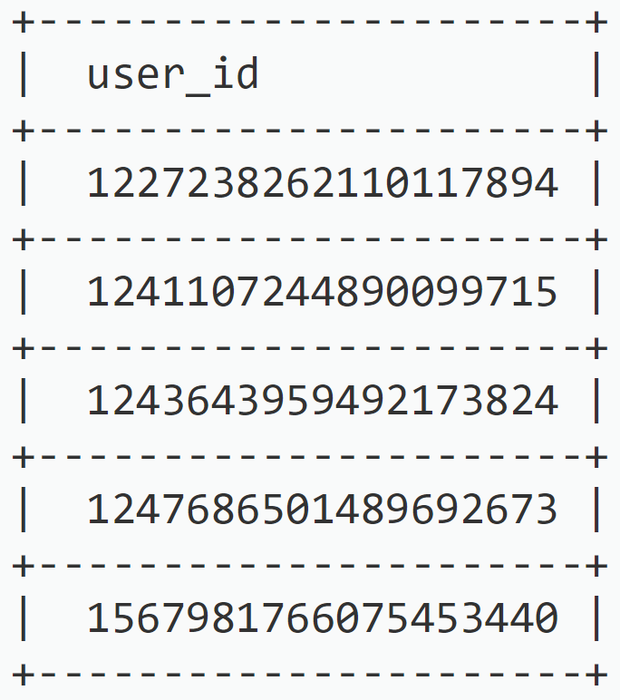

+++
title = "Por trás do Snowflake do Twitter: como gerar milhões de IDs exclusivos por segundo"
date = "2025-06-17"
+++

Imagine que você foi encarregado de projetar um sistema para gerar IDs exclusivos. À primeira vista, os requisitos parecem simples, mas, à medida que você se aprofunda, percebe que há mais coisas a serem consideradas. Vamos examinar as principais perguntas que você pode fazer:

**Quais são as características dos IDs exclusivos?**
- Eles devem ser exclusivos em todo o sistema
- Eles devem ser classificáveis, especialmente por tempo
- Eles precisam ser gerados de forma rápida e eficiente

**Quais são as restrições técnicas?**
- Os IDs devem caber em 64 bits (nem mais, nem menos)
- Eles devem ser apenas valores numéricos
- O sistema precisa lidar com alto rendimento (milhares de IDs por segundo)
- Os IDs criados posteriormente devem ser maiores do que os criados anteriormente

**Quais são os desafios?**
- Como garantir a exclusividade em sistemas distribuídos?
- Como manter a ordem temporal sem coordenação centralizada?
- Como lidar com alta taxa de transferência sem criar gargalos?

Esse foi exatamente o problema que o Twitter enfrentou ao projetar seu sistema de ID Snowflake. A solução deles? Uma abordagem brilhante que gera IDs exclusivos de 64 bits ordenados por tempo, capazes de lidar com milhões de eventos por segundo em data centers globais, tudo sem coordenação centralizada.

Em sua essência, o Snowflake é a solução inteligente do Twitter para o problema da geração de IDs. Pense nisso como uma maneira inteligente de criar números únicos que não apenas informam quando algo foi criado, mas também de onde veio. É como ter um carimbo de data/hora e uma tag de localização reunidos em um único número de 64 bits. A melhor parte? Ele funciona em vários servidores sem que eles precisem se comunicar entre si, tornando-o perfeito para sistemas que precisam lidar com grandes quantidades de dados.
<!--more-->

## Anatomia de um Snowflake ID



Um Snowflake ID é um número inteiro de 64 bits composto por quatro componentes, projetado para ser único, escalável e ordenado por tempo:

*   **Bit de sinal (1 bit):** reservado, definido como 0 para números inteiros positivos.
*   **Timestamp (41 bits):** Milissegundos desde uma época personalizada (por exemplo, a época do Twitter: 4 de novembro de 2010, 01:42:54.657 UTC, ou 1288834974657 ms). Suporta ~69,7 anos (2⁴¹ ms ≈ 69,7 anos).
* **worker/shardId (10 bits):** identifica o shard ou nó do banco de dados gerador, suportando 1.024 shards exclusivos (2¹⁰).
* **Número de sequência (12 bits):** um contador por milissegundo, permitindo 4.096 IDs por milissegundo por shard (2¹²).

O layout dos bits é:

| Bit de sinal (1 bit) | timestamp (41 bits)                         | ID do worker/shard (10 bits) | Número de sequência (12 bits)       |
|:----------------:|:--------------------------------------------|:--------------------------|:--------------------------------|
| 0                | `xxxxxxxxxxxxxxxxxxxxxxxxxxxxxxxxxxxxxxxxx` | `yyyyyyyyyy`              | `zzzzzzzzzzzz`                  |

O ID é calculado da seguinte forma:

```
ID = ((timestamp - epoch) << 22) | (shard_id << 12) | sequence
```

Principais propriedades:

* **Exclusividade:** O timestamp, o ID do shard e a sequência garantem que não haja colisões, assumindo relógios sincronizados e IDs de shards exclusivos.
*   **Ordenação temporal:** O timestamp nos bits mais significativos garante que os IDs sejam classificáveis cronologicamente.
*   **Rendimento:** Cada shard pode gerar 4.096 IDs/ms, ou ~4,1 milhões de IDs/segundo. Com 1.024 shards, o sistema suporta ~4,2 bilhões de IDs/segundo.

## Por que Snowflake? Motivação e tradeoffs

A geração tradicional de IDs em bancos de dados enfrenta dificuldades em ambientes distribuídos:

* IDs com incremento automático: sequências centralizadas (por exemplo, SERIAL do PostgreSQL) criam gargalos e exigem coordenação entre os shards.
* UUIDs (128 bits): globalmente exclusivos, mas sem ordem cronológica, grandes e ineficientes para índices B-tree em bancos de dados como o PostgreSQL.
* IDs aleatórios: não têm ordem e podem exigir verificações de colisão, reduzindo o desempenho.

Vantagens do Snowflake em um contexto de banco de dados:

* Geração descentralizada: cada shard do banco de dados gera IDs de forma independente usando seu ID de shard, evitando a coordenação entre nós.
* Alto rendimento: 4.096 IDs/ms por shard escalam linearmente com o número de shards.
* Compacidade: IDs de 64 bits são eficientes para armazenamento e indexação em comparação com UUIDs de 128 bits.
* Ordenação temporal: permite consultas de intervalo e varreduras de índice eficientes, essenciais para aplicativos como a linha do tempo do Twitter.

Tradeoffs:

* Sincronização de relógio: os nós do banco de dados devem ter relógios sincronizados (via NTP) para evitar colisões de carimbos de data/hora.
* Limitação da época: o carimbo de data/hora de 41 bits limita o sistema a ~69 anos a partir da época.
* Gerenciamento de shard ids: shard ids exclusivos devem ser atribuídos, muitas vezes exigindo configuração ou um serviço de coordenação.
* Esgotamento da sequência: gerar >4.096 IDs/ms por shard força uma espera, introduzindo latência.

## Matematiquês

O design do Snowflake aproveita a manipulação de bits e o particionamento baseado em tempo. Vamos analisar sua capacidade:

*   Timestamp (41 bits): O valor máximo é 2⁴¹ - 1 ≈ 2,2 trilhões de ms ≈ 69,7 anos. Com uma epoch de 1288834974657 (2010), os IDs são válidos até aproximadamente 2080.
*   Shard ID (10 bits): Suporta 2¹⁰ = 1.024 shards, suficiente para a maioria dos clusters de banco de dados.
*   Sequence Number (12 bits): Suporta 2¹² = 4.096 IDs/ms por shard, ou 4,1 milhões de IDs/segundo/shard.
*   Throughput Total: Com 1.024 shards, o sistema suporta 1.024 × 4.096 = 4.194.304 IDs/ms, ou ~4,2 bilhões de IDs/segundo.

A ordenação temporal é determinística: para IDs ID1 = (t1 << 22) | (s1 << 12) | seq1 e ID2 = (t2 << 22) | (s2 << 12) | seq2, se t1 < t2, então ID1 < ID2, independentemente do shard ou sequence.

## Mecânica do Snowflake em SQL

Em um banco de dados como PostgreSQL, os IDs Snowflake são gerados usando uma combinação de sequence (para o número de sequência) e funções do lado do servidor (para timestamp e shard ID). A função usa bit manipulation para montar o ID, aproveitando o plpgsql do PostgreSQL para performance.

### Geração de Timestamp

O timestamp é calculado como:

`timestamp = FLOOR(EXTRACT(EPOCH FROM clock_timestamp()) * 1000) - epoch`

`clock_timestamp()` fornece o tempo atual com precisão de milissegundos, e a epoch é subtraída para alinhar com a estrutura do Snowflake.

### Shard ID

O Shard ID (10 bits) identifica a instância do banco de dados ou shard. Pode ser:

*   Hardcoded na função (por exemplo, `shard_id = 1`).
*   Configurado via parâmetro ou tabela do banco de dados.
*   Derivado dinamicamente (por exemplo, de um node identifier armazenado em uma tabela de configuração).

### Sequence Number

Um objeto `SEQUENCE` do PostgreSQL gera o sequence number, módulo 2¹² (4.096), para caber no campo de 12 bits. A sequence é tipicamente local ao banco de dados, garantindo que não seja necessária coordenação entre shards.

### Montagem do ID

O ID é montado usando bitwise operations:

`ID = (timestamp << 22) | (shard_id << 12) | sequence`

Os operadores bitwise do PostgreSQL (`<<` para left-shift, `|` para OR) são usados para combinar os componentes.

## Implementação SQL

Abaixo está uma implementação refinada do gerador de IDs Snowflake em PostgreSQL, otimizada para uso em produção com error handling, flexibilidade de configuração e considerações de performance:

```sql
 -- Cria uma sequence para o sequence number de 12 bits (0 a 4095)
 CREATE SEQUENCE public.global_id_seq MINVALUE 0 MAXVALUE 4095 CYCLE;
 ALTER SEQUENCE public.global_id_seq OWNER TO postgres;

-- Cria a função geradora de IDs Snowflake
 CREATE OR REPLACE FUNCTION public.id_generator(shard_id_param int DEFAULT 1)
 RETURNS bigint
 LANGUAGE 'plpgsql' VOLATILE
 AS $BODY$
 DECLARE
 our_epoch bigint := 1288834974657; -- Época do Twitter: 4 de novembro de 2010
 seq_id bigint;
 now_millis bigint;
 shard_id int;
 result bigint;
 BEGIN
 -- Valida o shard_id (0 a 1023)
 IF shard_id_param < 0 OR shard_id_param >= 1024 THEN
 RAISE EXCEPTION 'O Shard ID deve estar entre 0 e 1023, recebido: %', shard_id_param;
 END IF;
 shard_id := shard_id_param & (1 << 10 - 1); -- Mask para 10 bits

-- Obtém o sequence number (0 a 4095)
SELECT nextval('public.global_id_seq') INTO seq_id;

-- Obtém o timestamp atual em milissegundos
SELECT FLOOR(EXTRACT(EPOCH FROM clock_timestamp()) * 1000) INTO now_millis;

-- Verifica o clock skew
IF now_millis < our_epoch THEN
    RAISE EXCEPTION 'O clock retrocedeu antes da epoch! Atual: %, Epoch: %', now_millis, our_epoch;
END IF;

-- Monta o ID: (timestamp << 22) | (shard_id << 12) | sequence
result := (now_millis - our_epoch) << 22;
result := result | (shard_id << 12);
result := result | (seq_id & (1 << 12 - 1)); -- Mask para 12 bits

RETURN result;

END; $BODY$;

ALTER FUNCTION public.id_generator(int) OWNER TO postgres;

-- Exemplo de uso: Gera um ID com shard_id = 1
-- SELECT public.id_generator(1);

